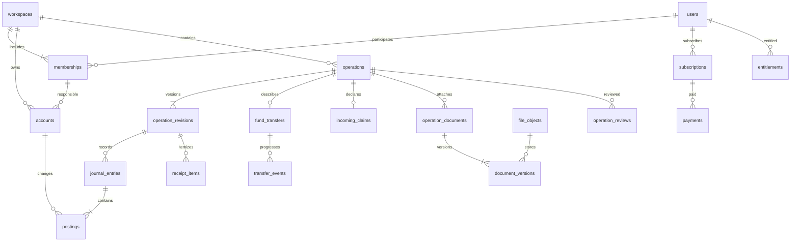

# «Баланс»: структура базы данных

Версия 1.0 · 10 сентября 2026 года.

Основание: [ТЗ первой версии](01-first-version.md), включая совместный бюджет, проверку документов и передачу отчётов; [развитие продукта](02-product-development.md) используется только для точек расширения.

Статус: проект модели данных для реализации. Документ определяет таблицы, ключи, правила записи и доступа; SQL-миграции и приложение ещё не реализованы. PostgreSQL — основная БД, приватное объектное хранилище — оригиналы файлов. Очередь может ускорять обработку, но долговечное состояние задач хранится в БД.

## 1. Основные решения

1. Личный учёт и каждый совместный бюджет — отдельные `workspaces`. Все финансовые данные обязательно имеют `workspace_id`. Руководитель общего бюджета не получает доступа к личному пространству подчинённого.
2. `operations` — карточки для человека; `operation_revisions` — версии карточек; `journal_entries` и `postings` — неизменяемый журнал фактического движения денег. Остатки рассчитываются по проводкам.
3. Выдача, частичные подтверждения и возврат денег — связанные передачи `fund_transfers`. Отправленные, но не подтверждённые средства находятся на отдельном техническом счёте «В пути».
4. Заявленный приход до сверки хранится отдельно от проводок. Он виден руководителю и влияет только на отдельно подписанный заявленный остаток.
5. Чеки связаны с карточкой операции, имеют версии и собственный жизненный цикл. Истечение подписки не удаляет файлы.
6. Оплата сервиса отделена от пользовательского финансового учёта. Бесплатный доступ — отдельное право, а не фиктивный платёж.

## 2. Соглашения

| Обозначение | Правило |
|---|---|
| `id`, ссылки `*_id` | `uuid`, кроме явно указанных ключей; ID создаёт приложение |
| Общие поля | У сущностей есть `created_at timestamptz`; у изменяемых — `updated_at timestamptz`, `version integer > 0` |
| `?` после поля | Допускается NULL; остальные перечисленные поля обязательны, если не оговорено условие |
| Денежные суммы | `numeric(20,6)`; конечные суммы кратны минимальной единице валюты; никакого float |
| Валюты | `currencies(code text PK, minor_units smallint)`; финансовые суммы ссылаются на этот справочник |
| Курс | `numeric(28,12) > 0`; направление явно определено: единиц базовой валюты за 1 единицу исходной |
| Даты | `occurred_on date` — дата учёта; `occurred_at timestamptz?` — известное точное время; `date_precision = date/time` |
| Часовой пояс | IANA-имя; сохраняется снимок зоны при вводе. Относительная дата привязана к исходному сообщению |
| Статусы | `text` с CHECK по перечисленным значениям, расширяются миграциями |
| JSONB | Только меняющиеся настройки, AI-результаты и снимки; суммы, связи, роли и статусы — обычные поля |
| Связи пространства | Для каждой локальной сущности `UNIQUE(workspace_id,id)`; ссылки составные `(workspace_id,entity_id)` |
| Удаление | Обычная отмена финансовой записи сохраняет историю. Физическое удаление по политике приватности — отдельная процедура |

Во всех таблицах ниже `id` подразумевается, кроме таблиц с явно указанным составным PK. Все локальные таблицы, включая строки чеков, версии, проводки, связи тегов, задания и файлы, имеют обязательный `workspace_id`. Общие технические таблицы могут иметь `workspace_id?`, если событие относится к оплате или администрированию.

Округление конечных сумм: до `currencies.minor_units`, половины — от нуля. Исходные цены строк и курсы сохраняются с большей точностью. Остатки разных валют никогда не складываются без явного пересчёта. Базовая валюта пространства в первой версии фиксируется при создании; её смена требует отдельной миграции учёта.

## 3. Основные связи

Диаграмма показывает главные связи; полная модель приведена далее.

## 4. Пользователи, пространства и доступ

| Таблица | Поля и назначение | Ограничения |
|---|---|---|
| `users` | `telegram_user_id bigint?`, `username?`, `display_name?`, `status(active/suspended/deleting/anonymized)`, `last_seen_at?`, `bot_blocked_at?` | Telegram ID уникален, обязателен для действующего профиля; username не идентификатор |
| `user_settings` | `user_id PK/FK`, `language`, `timezone`, `default_currency`, `save_mode(confirm/auto)`, `personal_media_enabled`, `notification_time`, `quiet_start?`, `quiet_end?` | Одна строка на пользователя; обработка голоса и изображений включена по умолчанию, отдельное согласие для распознавания не требуется; тихие часы либо оба NULL, либо оба заполнены |
| `consents` | `user_id`, `document_kind`, `document_version`, `accepted_at`, `withdrawn_at?`, `context_workspace_id?` | Не перезаписывать прежнее согласие; фиксировать условия совместного хранения при вступлении |
| `role_grants` | `user_id`, `role(owner/admin/support)`, `permissions jsonb`, `granted_by`, `reason`, `revoked_at?` | Сервисные роли отделены от ролей бюджета |
| `workspaces` | `kind(personal/shared)`, `name`, `owner_user_id`, `base_currency`, `timezone`, `week_start`, `month_start_day`, `status(active/deleting/deleted)` | Один личный workspace на владельца: частичный UNIQUE; день начала месяца 1–28 в первой версии |
| `workspace_settings` | `workspace_id PK/FK`, `receipt_required`, `default_save_mode`, `notification_policy jsonb` | Настройки общего пространства принадлежат руководителю |
| `memberships` | `workspace_id`, `user_id`, `role(owner/member)`, `status(pending/active/left/removed)`, `accepted_at?`, `approved_at?`, `approved_by?`, `ended_at?`, `display_label?` | UNIQUE(workspace_id,user_id); один активный owner; owner совпадает с владельцем workspace |
| `invitations` | `workspace_id`, `token_hash`, `created_by`, `expires_at`, `target_telegram_id?`, `accepted_by?`, `accepted_at?`, `approved_by?`, `approved_at?`, `revoked_at?` | UNIQUE(token_hash); секрет ссылки не хранится открыто; одно использование |
| `diagnostic_grants` | `workspace_id`, `grantee_user_id`, `issued_by`, `permissions jsonb`, `reason`, `starts_at`, `expires_at`, `revoked_at?` | Ограниченный срок и область; каждое использование в аудите |

В личном пространстве допускается только владелец. Создание workspace и owner-membership атомарно. В совместном пространстве переход membership в `active` разрешён только после принятия пользователем и проверки Telegram ID руководителем. Повторное приглашение возвращает существующее членство в pending; старые полномочия не восстанавливаются автоматически. Историю статусов фиксирует аудит.

`owner_user_id` одновременно определяет плательщика общего бюджета. Смена владельца в первой версии не предусмотрена. Удаление аккаунта владельца сначала требует отдельно решить судьбу принадлежащих ему совместных пространств; простое обезличивание не должно оставлять их без управляющего.

## 5. Счета и классификация

| Таблица | Поля | Ограничения |
|---|---|---|
| `accounts` | `workspace_id`, `name`, `kind(cash/card/savings/custom/transit)`, `currency`, `responsible_membership_id?`, `transfer_id?`, `archived_at?` | Валюта неизменна после первой проводки; для обычного счёта ответственный обязателен; transit принадлежит одной передаче |
| `categories` | `workspace_id`, `name`, `kind(income/expense)`, `archived_at?`, `template_code?` | UNIQUE(workspace_id,kind,normalized_name) для активных; базовые категории копируются в workspace |
| `category_rules` | `workspace_id`, `membership_id`, `match_kind(keyword/merchant)`, `pattern`, `category_id`, `priority`, `enabled` | Личное правило автора внутри выбранного пространства; не обучает других пользователей |
| `account_aliases` | `workspace_id`, `membership_id`, `account_id`, `alias`, `last_four?`, `confirmed_at` | Только подтверждённое сопоставление; не хранить полный номер карты |
| `tags` | `workspace_id`, `name` | UNIQUE(workspace_id,normalized_name) |
| `operation_revision_tags` | `workspace_id`, `revision_id`, `tag_id` | PK(revision_id,tag_id), составные FK пространства |

`normalized_name` — отдельное нормализованное поле, которое приложение записывает вместе с названием. Контрагента первой версии достаточно хранить текстом в версии операции; отдельный общий справочник продавцов не нужен.

Начальный остаток — операция `opening` на выбранную дату, а не второе независимое поле баланса. Изменение начального остатка проходит через новую версию этой операции. Архивирование счёта запрещает новые записи, но сохраняет историю.

На счёт разрешена одна действующая opening-операция; проверка выполняется под блокировкой счёта. Для transit начальный остаток всегда ноль, ручные opening/expense/income запрещены. Проводки transit создают только процедуры передачи и явно разрешённого урегулирования расхождения.

## 6. Операции, версии и проводки

### 6.1. Карточки

| Таблица | Поля |
|---|---|
| `operations` | `workspace_id`, `created_by_user_id`, `responsible_membership_id`, `kind(expense/income/refund/transfer/claim/opening/adjustment)`, `state(active/voided)`, `current_revision_id`, `source_draft_id? UNIQUE`, `idempotency_key`, `review_state(unreviewed/accepted/needs_info)`, `document_set_version integer`, `voided_at?`, `void_reason?` |
| `operation_revisions` | `workspace_id`, `operation_id`, `revision_no`, `edited_by_user_id`, `change_reason`, `account_id?`, `amount?`, `currency?`, `category_id?`, `description?`, `merchant?`, `occurred_on`, `occurred_at?`, `date_precision`, `timezone_snapshot`, `source_kind(text/voice/receipt/screenshot/terminal/manual)`, `refund_of_operation_id?`, `base_amount?`, `base_currency?`, `fx_rate?`, `fx_date?`, `fx_source?`, `income_source?`, `purpose?` |
| `receipt_items` | `workspace_id`, `revision_id`, `line_no`, `name`, `quantity numeric(20,6)?`, `unit_price?`, `discount?`, `line_total?`, `currency`, `recognition_confidence?` |

UNIQUE(workspace_id,idempotency_key), UNIQUE(operation_id,revision_no), UNIQUE(revision_id,line_no). `current_revision_id` должен ссылаться на версию именно этой операции: составной FK `(workspace_id,id,current_revision_id)` → `(workspace_id,operation_id,id)` с отложенной проверкой для первоначальной вставки.

У расхода, дохода, возврата и начального остатка обязательны счёт, сумма и валюта; у корректировки сумма знаковая и ненулевая, у начального остатка может быть ноль. Для расхода, дохода и возврата сумма положительна. Категория расхода/возврата имеет kind=expense, дохода — income. Счёт находится в том же workspace, имеет ту же валюту и принадлежит ответственному участнику. Для перевода денежные стороны находятся в `fund_transfers`, для заявления — в `incoming_claims`; поля обычного расхода для них NULL. В первой версии тип операции после сохранения меняется только отменой и созданием новой связанной записи.

Связь возврата с расходом необязательна. Если она есть, валюта, пространство и ответственный совпадают; сумма действующих возвратов не превышает исходный расход. Проверка выполняется с блокировкой исходной операции; при уменьшении расхода проверяется тот же предел. У несвязанного возврата категория выбирается явно. Возврат уменьшает расходы на свою дату, а не переписывает отчёт о прошлой покупке.

Суммы и даты строк чека — пояснение. В финансовые отчёты попадает итог операции один раз. Изменение классификации создаёт новую версию; прежняя остаётся доступна для аудита.

### 6.2. Журнал движения денег

| Таблица | Поля и ограничения |
|---|---|
| `journal_entries` | `workspace_id`, `revision_id`, `event_kind(opening/expense/income/refund/adjustment/transfer_sent/transfer_received/transfer_returned/reversal)`, `effective_on date`, `effective_at?`, `reverses_entry_id? UNIQUE`, `idempotency_key`; UNIQUE(workspace_id,idempotency_key) |
| `postings` | `workspace_id`, `entry_id`, `line_no`, `account_id`, `currency`, `delta numeric(20,6)`; PK(entry_id,line_no), delta != 0 |

Это журнал изменений активных денежных счетов, а не полная бухгалтерская двойная запись с расходными и доходными счетами. У расхода одна проводка −amount, у дохода/возврата +amount; у внутреннего перевода две противоположные проводки. Нулевой начальный остаток может иметь запись журнала без проводок; остальные финансовые события обязаны иметь установленный набор строк.

Остаток счёта на дату D = SUM(postings.delta) по всем проведённым записям с effective_on ≤ D, включая сторно. Отдельно суммируются обычные и транзитные счета. Отрицательный остаток разрешён. Материализованный баланс может быть только восстанавливаемым кэшем.

Проводки и journal_entries не редактируются обычными правами приложения. Исправление финансовых полей: заблокировать операцию → проверить ожидаемую version и период → создать новую ревизию → добавить точное сторно старых проводок и новые проводки → переключить current_revision → записать аудит и outbox → commit. Сторно компенсирует исходную запись на её effective_on; новая запись получает исправленную дату. Обе даты должны быть открыты. Изменение только описания или категории проводок не создаёт.

Отмена аналогична исправлению, но создаёт только сторно и state=voided. Для передачи после отправки обычная отмена запрещена: требуется реальное обратное движение либо исправление с проверкой всех зависимых событий. Передачи с подтверждениями нельзя редактировать как простой расход.

Отчёт доходов/расходов строится по текущим версиям active-операций income/expense/refund. Журнал нужен для остатков, а не для повторного подсчёта тех же расходов. Opening, adjustment, transfer и claim исключаются из доходов/расходов. Заданный курс и base_amount сохраняются в версии; если пересчёт есть, все поля курса заполнены совместно. При равной валюте курс=1; при отсутствии курса разные валюты показываются раздельно.

## 7. Выдача денег, частичное получение и сверка

| Таблица | Поля и ограничения |
|---|---|
| `fund_transfers` | `workspace_id`, `operation_id UNIQUE`, `sender_membership_id`, `recipient_membership_id`, `from_account_id`, `to_account_id`, `source_amount`, `source_currency`, `target_amount`, `target_currency`, `fx_rate?`, `fx_date?`, `fx_source?`, `mode(instant/acknowledged)`, `state(planned/in_transit/partial/completed/disputed/cancelled)`, `purpose`, `report_due_on?`, `transit_account_id?` |
| `transfer_events` | `workspace_id`, `transfer_id`, `kind(sent/received/returned_to_sender/discrepancy/resolved)`, `amount?`, `currency`, `occurred_on`, `actor_user_id`, `journal_entry_id? UNIQUE`, `idempotency_key`, `note?`; UNIQUE(transfer_id,idempotency_key) |
| `incoming_claims` | `workspace_id`, `operation_id UNIQUE`, `account_id`, `amount > 0`, `currency`, `source_description`, `purpose`, `actually_received boolean`, `state(pending/partially_reconciled/reconciled/rejected)`, `rejection_reason?` |
| `claim_allocations` | `workspace_id`, `claim_id`, `amount > 0`, `transfer_event_id?`, `external_income_operation_id?`, `resolved_by`, `resolved_at`; ровно одна целевая ссылка |

Отправитель и получатель могут совпадать для перевода между своими счетами, но from_account != to_account. Счета должны принадлежать указанным участникам. При mode=acknowledged валюта сторон одинакова, source_amount=target_amount, transit обязателен и имеет ту же валюту. В первой версии совместные выдачи — только в одной валюте; обмен между личными валютными счетами допускается мгновенно с явными суммами сторон и снимком курса. Это проектное ограничение исключает неоднозначное распределение курсовой разницы при частичном получении.

Для instant обе стороны проводятся одной записью журнала, состояние становится completed. Для валютного instant `target_amount = round(source_amount × fx_rate)`; суммы разных валют не проверяются на простое равенство. Комиссия — отдельная expense-операция, связанная через `operation_links(workspace_id,from_operation_id,to_operation_id,kind=fee_for)` с составным PK по двум ID и kind.

Для acknowledged на каждую передачу создаётся свой transit-счёт. Сценарий:

| Событие | Счёт руководителя | В пути | Счёт участника | Влияние на доходы/расходы |
|---|---:|---:|---:|---|
| План выдачи 20 000 | 0 | 0 | 0 | Нет |
| Отправлено 20 000 | −20 000 | +20 000 | 0 | Нет |
| Получено 12 000 | 0 | −12 000 | +12 000 | Нет |
| Получено ещё 8 000 | 0 | −8 000 | +8 000 | Нет |
| Расход участника 6 500 | 0 | 0 | −6 500 | Расход 6 500 |
| Возврат руководителю: отправлено 3 000 | 0 | +3 000 | −3 000 | Нет; новая обратная передача |
| Возврат руководителю: получено 3 000 | +3 000 | −3 000 | 0 | Нет |

Итог участника 10 500. Каждая стадия передачи сохраняет общий остаток пространства. `returned_to_sender` предназначен для подтверждённого возврата ещё не полученных средств из transit отправителю. Если участник уже получил деньги, используется новая обратная передача.

Отправка разрешена один раз, в полном размере плана; дальнейшие выдачи — новые передачи. Подтверждения частичные. При блокировке fund_transfer проверяется: received + returned_to_sender ≤ sent. Discrepancy сама проводок не создаёт. Исправить потерю денег можно только явной корректировкой с причиной, не молчаливым закрытием transit. Статус — кэш результата событий; сумма фактических подтверждений вычисляется из событий.

Состояние отчёта о выданных средствах хранить отдельно от получения денег: `fund_transfer_reports(workspace_id,transfer_id UNIQUE,state(pending/submitted/accepted/needs_info),submitted_at?,reviewed_at?,reviewed_by?,comment?)`. Состояние completed передачи означает завершение движения денег, но не принятие отчёта. Просрочен отчёт с report_due_on в прошлом и state != accepted; принятые отчёты из списка просроченных исключаются. Состав отчёта фиксируется связями `fund_transfer_report_operations(workspace_id,report_id,operation_id)` с PK(report_id,operation_id), без дополнительного влияния на проводки. Если расход финансируется несколькими выдачами, в первой версии отчёт показывает его целиком с отметкой пересечения, а не складывает повторно в общий расход участника.

Заявление «получил 20 000» создаёт claim без проводок. При сверке с выдачей руководитель связывает заявление с событием received; если получению ещё нет события, оно создаётся в этой же транзакции после проверки факта подтверждения участником. Если это внешний приход, создаётся income с источником/назначением и allocation. Уже имеющееся получение можно связать, не создавая повторную проводку.

При блокировке claim и целевых записей проверяются суммы allocations: не выше суммы claim, а по каждой целевой записи — не выше её суммы. Совпадают валюта, счёт и ответственный. Несверенная часть = amount − SUM(allocations.amount). Отклонение исключает только оставшуюся несверенную часть; ранее проведённые суммы отменяются отдельной корректировкой.

Сверенный остаток участника = остаток его обычных счетов по журналу. Заявленный остаток = сверенный + несверенные части actually_received заявлений в pending/partially_reconciled. Расходы уменьшают оба остатка независимо от проверки. Показатели dashboard «в пути», «выдано», «получено», «внешний приход» считаются отдельно и не складываются повторно в остаток.

## 8. Проверка, закрытие периодов и документы

| Таблица | Поля и назначение |
|---|---|
| `operation_reviews` | `workspace_id`, `operation_id`, `revision_id`, `document_set_version`, `reviewer_user_id`, `decision(accepted/needs_info)`, `comment?`, `receipt_exception_reason?`; история решений неизменяема |
| `change_requests` | `workspace_id`, `operation_id`, `requested_by`, `base_revision_id`, `base_document_set_version`, `action(edit/void/replace_document/delete_document)`, `proposal jsonb`, `reason`, `state(pending/approved/rejected/applied)`, `decided_by?`, `decided_at?`, `applied_revision_id?` |
| `accounting_periods` | `workspace_id`, `starts_on`, `ends_on_exclusive`, `state(open/closed)`, `closed_by?`, `closed_at?`, `reopened_by?`, `reopened_at?`, `reopen_reason?`; начало < конец, периоды одного workspace не пересекаются |
| `operation_documents` | `workspace_id`, `operation_id`, `document_kind(receipt/payment_confirmation/other)`, `current_document_version_id`, `state(active/deletion_requested/deleted)` |
| `document_versions` | `workspace_id`, `document_id`, `version_no`, `file_object_id`, `uploaded_by`, `replaces_version_id?`; UNIQUE(document_id,version_no) |
| `file_objects` | `workspace_id`, `uploaded_by`, `object_key UNIQUE`, `telegram_file_id?`, `telegram_file_unique_id?`, `original_filename?`, `mime_type`, `size_bytes bigint`, `sha256`, `state(uploading/quarantine/ready/failed/deleting/deleted)`, `scan_status(pending/clean/rejected)`, `retention_class(voice/personal_media/shared_evidence/report_export)`, `expires_at?`, `deleted_at?` |

Файл доступен из карточки только при state=ready и scan_status=clean. Реальный объект хранится вне БД; публичный URL не сохраняется. Контрольная сумма помогает проверять целостность и дубли, но не является уникальной: один документ может законно относиться к нескольким операциям в одном пространстве. Между пространствами файлы не переиспользуются.

`current_document_version_id` и `replaces_version_id` обязаны указывать на версии того же document; composite FK аналогичен версиям операций. Увеличивать `document_set_version` при добавлении, замене и удалении документа. Решение accepted действительно только для текущих revision_id и document_set_version. После изменения операция становится unreviewed; принятие при обязательном документе требует ready-файла либо receipt_exception_reason.

Участник исправляет только свои непроверенные записи. Принятая операция меняется через change_request: прежняя версия действует до применения одобренной правки; затем требуется новая проверка. Конфликт версий возвращает запрос на обновление предложения. Ошибочный файл общего бюджета удаляется по решению руководителя с причиной. Замена не уничтожает предыдущий оригинал.

Для первой версии любое изменение карточки или комплекта документов в закрытом периоде требует повторного открытия. Обычное чтение разрешено. Проверку закрытия и запись выполнять под одной блокировкой workspace; закрытие периода использует ту же блокировку, поэтому конкурентная запись не проскочит. Более тонкие блокировки вводить после измерения нагрузки.

Сроки из ТЗ: голос — 24 часа после обработки, личные изображения — 30 дней, shared_evidence — до удаления соответствующей операции/пространства по отдельной политике. Отмена записи не запускает удаление общего доказательного файла. Пока существует хотя бы одна сохраняемая ссылка на файл, его физическое удаление не выполняется. Для исходников зависших задач задать отдельный предельный срок обработки/очистки.

## 9. Входящие сообщения и AI

| Таблица | Поля и ограничения |
|---|---|
| `telegram_updates` | `bot_id text`, `update_id bigint`, `received_at`, `payload_encrypted?`, `state(received/processed/failed)`; UNIQUE(bot_id,update_id) |
| `input_batches` | `workspace_id`, `author_user_id`, `responsible_membership_id`, `bot_id`, `chat_id bigint`, `media_group_id?`, `source_sent_at`, `timezone_snapshot`, `save_mode_snapshot`, `state(collecting/queued/processing/ready/failed/cancelled)` |
| `input_messages` | `workspace_id`, `batch_id`, `telegram_update_id`, `bot_id`, `chat_id bigint`, `message_id bigint`, `message_version`, `source_kind`, `text_encrypted?`, `file_object_id?`; UNIQUE(bot_id,chat_id,message_id,message_version) |
| `drafts` | `workspace_id`, `batch_id`, `item_no`, `responsible_membership_id`, `state(needs_info/awaiting_payment_confirmation/ready/saved/cancelled)`, `proposed_fields jsonb`, `payment_status(unknown/pending/paid/failed/cancelled)`, `confidence jsonb`, `validation_errors jsonb`, `saved_operation_id?`, `version`; UNIQUE(batch_id,item_no) |
| `draft_sources` | `workspace_id`, `draft_id`, `input_message_id`; PK(draft_id,input_message_id) |
| `duplicate_candidates` | `workspace_id`, `draft_id`, `existing_operation_id`, `signals jsonb`, `decision?(attach/save_separately/dismiss)`, `decided_by?`, `decided_at?`; UNIQUE(draft_id,existing_operation_id) |
| `processing_jobs` | `workspace_id`, `batch_id`, `requested_by`, `billing_user_id`, `job_kind`, `state(queued/running/succeeded/failed/cancelled)`, `attempt_count`, `run_after`, `lease_until?`, `worker_token?`, `idempotency_key`, `last_error_code?`; UNIQUE(workspace_id,idempotency_key) |
| `ai_attempts` | `workspace_id`, `job_id`, `attempt_no`, `provider`, `model`, `prompt_version`, `schema_version`, `input_units`, `output_units`, `cost_amount?`, `cost_currency?`, `result_encrypted?`, `error_code?`, `started_at`, `finished_at?`; UNIQUE(job_id,attempt_no) |
| `conversation_states` | `user_id PK/FK`, `selected_workspace_id`, `active_draft_id?`, `state`, `expires_at`, `version` |
| `callback_actions` | `user_id`, `workspace_id?`, `token_hash UNIQUE`, `action`, `entity_id?`, `expected_version?`, `expires_at`, `consumed_at?`, `result_reference?` |

При приёме сообщения фиксировать workspace и ответственного в input_batch; дальнейшее переключение меню их не меняет. Перед AI, сохранением и доставкой результата повторно проверять действующее членство. У альбома одинаковый media_group_id уникален в рамках bot_id/chat_id; все его сообщения привязываются к уже закреплённому workspace, при конфликте выбора нужен явный выбор пользователя.

Один batch → несколько drafts; один draft → несколько исходников. Это поддерживает три расхода в тексте, список банковских операций и многостраничный чек. Автоклассификация не означает автоматического объединения разных покупок.

Сохранение draft блокирует его строку и проверяет version. Повтор возвращает уже созданную операцию. Один успешный draft имеет одну операцию, включая передачу/заявление. Связь saved_operation_id проверяется на обратное соответствие operations.source_draft_id. Редактирование Telegram-сообщения после сохранения не правит проведённую операцию автоматически.

Жёсткая идемпотентность относится к доставке webhook, команде и оплате. Похожие реальные покупки только создают duplicate_candidate; подтверждённое сохранение отдельной покупки разрешено. Attach связывает документ с существующей операцией без нового расхода.

AI не пишет финансовые таблицы. JSON-результат проходит валидацию типов, валюты, дат, статуса оплаты и разрешённых ID. Недостоверный/неоплаченный draft не создаёт проводок.

## 10. Подписка, платежи и квоты

| Таблица | Поля и ограничения |
|---|---|
| `plan_versions` | `plan_code`, `version_no`, `title`, `price_stars bigint > 0`, `billing_period_seconds`, `trial_days`, `features jsonb`, `terms_version`, `published_at?`, `retired_at?`; UNIQUE(plan_code,version_no), опубликованная версия неизменяема |
| `plan_quotas` | `plan_version_id`, `metric(text_requests/voice_seconds/images/storage_bytes)`, `limit_value bigint >= 0`, `window_kind(billing_period/current_storage)`; PK(plan_version_id,metric) |
| `subscriptions` | `user_id`, `plan_version_id`, `provider_subscription_id?`, `status(pending/active/expired/cancelled)`, `auto_renew boolean`, `current_period_start?`, `current_period_end?`, `cancelled_at?` |
| `payment_invoices` | `user_id`, `subscription_id`, `plan_version_id`, `invoice_payload_hash UNIQUE`, `expected_stars`, `currency=XTR`, `expires_at`, `state(created/paid/expired)` |
| `payments` | `user_id`, `subscription_id`, `invoice_id`, `telegram_charge_id UNIQUE`, `stars_amount bigint > 0`, `currency=XTR`, `paid_at`, `service_period_start`, `service_period_end`, `state(succeeded/partially_refunded/refunded)` |
| `payment_events` | `provider`, `provider_event_id`, `payment_id?`, `received_at`, `event_type`, `payload_encrypted`, `processed_at?`, `error_code?`; UNIQUE(provider,provider_event_id) |
| `payment_refunds` | `payment_id`, `amount_stars`, `reason`, `requested_by`, `idempotency_key UNIQUE`, `state(requested/succeeded/failed)`, `provider_refund_id?`, `completed_at?` |
| `entitlements` | `user_id`, `kind(trial/paid/admin_free/manual)`, `plan_version_id?`, `payment_id?`, `starts_at`, `ends_at?`, `revoked_at?`, `issued_by?`, `reason?`; UNIQUE(payment_id) при paid; один trial на пользователя |
| `entitlement_events` | `entitlement_id`, `action(granted/revoked/adjusted)`, `reason`, `actor_user_id?`, `payment_event_id?`, `previous_end?`, `new_end?`; неизменяемая история |
| `usage_counters` | `billing_user_id`, `metric`, `window_start`, `window_end`, `limit_snapshot bigint?`, `used bigint`, `reserved bigint`; UNIQUE(billing_user_id,metric,window_start), значения ≥ 0 |
| `usage_reservations` | `counter_id`, `job_id?`, `file_object_id?`, `units bigint > 0`, `state(reserved/consumed/released)`, `expires_at`, `idempotency_key UNIQUE`; ровно один источник |

Trial, paid и admin_free вычисляются по активным entitlements; suspended у users имеет приоритет. Expired — отсутствие действующего права, а не повод удалять историю. Сервисная роль admin сама не выдаёт admin_free; снятие роли не создаёт подписку. Отмена auto_renew не отзывает оплаченный entitlement.

У trial/paid/manual срок обязателен; бессрочный admin_free допускает ends_at=NULL. Периоды доступа задаются проверенными данными платежа/условий, а не `now + месяц` при каждом webhook. События, пришедшие не по порядку, добавляют свои интервалы без сокращения более позднего доступа. Проверка платежа включает payer, invoice, сумму, валюту и назначение. Обработка payment + entitlement + event + outbox атомарна. Refund не является возвратом пользовательской покупки; после успешного возврата доступ меняется по опубликованной политике и журналируется. Сумма успешных возвратов ограничена исходной оплатой под блокировкой payment.

Для общего бюджета billing_user_id = workspaces.owner_user_id. Для личного — автор-владелец. Billing user фиксируется при приёме задания. Потребление приглашённого не списывается второй раз с него.

Резерв квоты: заблокировать counter → проверить used + reserved + units ≤ limit_snapshot → увеличить reserved и создать reservation одной транзакцией. Успех переносит резерв в used один раз; ошибка освобождает его. Повтор успешного job не создаёт нового списания. Истечение lease не освобождает резерв, пока старый worker может завершить работу: worker_token отсекает устаревшие результаты. Квоты голоса считаются секундами, не округлёнными минутами для каждого повтора.

У admin_free limit_snapshot=NULL, но учёт фактического потребления и технические ограничения сохраняются. Для хранилища counter отражает занятые байты: они освобождаются только после подтверждённого удаления объекта. Для нового расчётного периода создаётся новый counter; предыдущие незавершённые резервы остаются в своём окне.

## 11. Лимиты, отчёты, уведомления и поддержка

| Таблица | Поля и ограничения |
|---|---|
| `budget_limits` | `workspace_id`, `responsible_membership_id?`, `category_id?`, `currency`, `amount > 0`, `period_start`, `period_end_exclusive`; UNIQUE NULLS NOT DISTINCT(workspace_id,responsible_membership_id,category_id,currency,period_start) |
| `budget_threshold_events` | `workspace_id`, `budget_limit_id`, `threshold(80/100)`, `triggered_at`; UNIQUE(budget_limit_id,threshold) |
| `report_snapshots` | `workspace_id`, `created_by`, `scope_membership_id?`, `period_start`, `period_end_exclusive`, `timezone_snapshot`, `filters jsonb`, `visible_fields jsonb`, `is_partial`, `snapshot_payload jsonb`, `state(preview/confirmed/prepared)`, `confirmed_at?`, `content_hash`, `expires_at?` |
| `report_parts` | `workspace_id`, `snapshot_id`, `part_no`, `rendered_text`, `telegram_message_id?`; UNIQUE(snapshot_id,part_no) |
| `export_jobs` | `workspace_id`, `requested_by`, `scope_membership_id?`, `filters jsonb`, `format=csv`, `state(queued/running/ready/failed/expired)`, `file_object_id?`, `expires_at`, `error_code?` |
| `notification_preferences` | `user_id`, `workspace_id?`, `event_type`, `enabled`, `delivery_mode(immediate/daily/weekly)`, `local_time?`, `weekday?`, `timezone`; UNIQUE NULLS NOT DISTINCT(user_id,workspace_id,event_type) |
| `notifications` | `workspace_id?`, `recipient_user_id`, `event_type`, `dedupe_key UNIQUE`, `scheduled_at`, `state(pending/sending/sent/failed/cancelled)`, `attempt_count`, `telegram_message_id?`, `payload_encrypted?` |
| `outbox_events` | `workspace_id?`, `event_type`, `aggregate_id`, `idempotency_key UNIQUE`, `payload jsonb`, `available_at`, `attempt_count`, `lease_until?`, `delivered_at?` |
| `support_tickets` | `user_id`, `kind(general/payment)`, `subject`, `state(open/answered/closed)` |
| `support_messages` | `ticket_id`, `author_user_id`, `body_encrypted`, `user_disclosed_context?`; чужие финансовые данные автоматически не прикладывать |
| `audit_log` | `workspace_id?`, `actor_user_id?`, `action`, `entity_type`, `entity_id?`, `request_id`, `reason?`, `changed_fields jsonb`, `occurred_at`; только добавление |
| `admin_sessions` | `user_id`, `token_hash UNIQUE`, `authenticated_at`, `step_up_at?`, `expires_at`, `revoked_at?` |
| `service_config_versions` | `config_kind(ai/help/notification_template/category_template)`, `version_no`, `value jsonb`, `published_by`, `published_at`; UNIQUE(config_kind,version_no), без секретов |

Для общего бюджета общий лимит имеет responsible_membership_id=NULL и доступен руководителю; лимит участника имеет его membership_id. category_id=NULL означает общий лимит по категориям. Каждый месяц — отдельная строка budget_limit, поэтому событие порога уникально за месяц. Пересечение порога создаётся вместе с outbox, повторное падение и рост расходов его не дублируют. Суммы валюты без курса исключаются из пересчитанного лимита с явной отметкой неполноты.

Снимок отчёта содержит только разрешённую выборку и поля после фильтрации; исключение категорий пересчитывает все итоги. Он строится в согласованном снимке транзакции БД. Участнику scope_membership_id обязателен и совпадает с его членством; руководителю разрешена общая выборка. Повторная проверка доступа нужна и при подтверждении, и перед выдачей экспорта/сообщений.

Report parts формируются до подтверждения и показываются целиком. После подтверждения содержимое снимка и частей неизменно; правки настроек создают новый снимок. В пересылаемых частях отсутствуют внутренние ID, документы и ссылки на оригиналы. Получателя в БД хранить не требуется: бот готовит сообщение владельцу, который пересылает его сам.

Outbox создаётся в транзакции изменения данных. Внешняя доставка допускает повтор: при потере ответа Telegram нельзя обещать ровно одно исходящее сообщение. Это не должно повторять финансовое действие. Перед уведомлением проверяются актуальные права и блокировка бота; в outbox предпочтительны ID, а содержание строится после проверки доступа. Для недельной сводки dedupe_key включает пользователя, пространство и локальный отчётный период; для порога — ID лимита и порог.

## 12. Изоляция данных и ограничения БД

| Объект | Владелец личного пространства | Руководитель общего | Участник общего | Администратор сервиса |
|---|---|---|---|---|
| Счета/операции/чеки | Все свои | Все в своём workspace | Только свои по responsible_membership_id | Нет по умолчанию |
| Передачи | Свои | Все в workspace | Только где отправитель/получатель — он | Нет по умолчанию |
| Общий отчёт | Свой | Да | Нет; только собственная выборка | Нет по умолчанию |
| Правки | Свои, в открытом периоде | С аудитом и правилами проверки | Свои непроверенные либо запрос | Нет по умолчанию |
| Подписки/метрики | Свои | Только своя подписка | Только своя подписка | По сервисным разрешениям |

Участник видит сведения второй стороны своей передачи только в объёме карточки передачи, без доступа к другим счетам/истории этой стороны. Для документов и вложенных объектов доступ наследуется от родительской операции, а не от uploaded_by. Финансовые агрегаты и export обязаны применять те же правила, что карточки.

Основная защита — серверная авторизация плюс PostgreSQL RLS для таблиц пространства. Для service role БД не выдавать SUPERUSER/BYPASSRLS; использовать отдельную миграционную роль и FORCE ROW LEVEL SECURITY где необходимо. Идентификатор действующего пользователя задаёт только проверенный backend в пределах транзакции, с очисткой контекста при возврате соединения в пул. Для фонового задания задаются автор и workspace; системные maintenance-процедуры используют отдельные минимальные полномочия и аудит. Особенности обхода RLS владельцами таблиц описаны в [документации PostgreSQL](https://www.postgresql.org/docs/current/ddl-rowsecurity.html).

Обязательные механизмы при реализации:

| Правило | Где обеспечивается |
|---|---|
| Существование и принадлежность связанного объекта workspace | Составные FK, не только фильтр приложения |
| Допустимые статусы, положительность, совместная заполненность | NOT NULL + CHECK |
| Уникальность webhook/платежа/команды/версии | UNIQUE/частичный уникальный индекс |
| Непересечение периодов | EXCLUDE по workspace и daterange [start,end), при реализации расширение btree_gist |
| Сумма и набор проводок соответствуют событию | Отложенный constraint trigger + запись через одну процедуру |
| Валюта/владелец счёта соответствуют операции | Составные FK где возможно, иначе constraint trigger |
| Предел частичных подтверждений, возвратов и сверки | Блокировка родительской строки + проверка в процедуре |
| Параллельная правка или нажатие старой кнопки | Optimistic version + row lock + ключ идемпотентности |
| Одновременное закрытие периода и запись | Общая блокировка workspace до конца транзакции |
| Изменение review_state и current_revision | Только процедура с проверкой роли, версии и комплекта файлов |
| Неизменяемость журнала | Отзыв UPDATE/DELETE у runtime роли; разрешённые процедуры записи |

CHECK не используется для проверки сумм по нескольким строкам: PostgreSQL не гарантирует такие межстрочные проверки через CHECK. Для них предусмотрены FK/UNIQUE/EXCLUDE либо триггеры и блокировки. [Документация ограничений PostgreSQL](https://www.postgresql.org/docs/current/ddl-constraints.html).

Порядок блокировок во всех финансовых процедурах: workspace → операции/передачи/claims по ID → счета по ID. Смена членства берёт блокировку workspace, поэтому не конкурирует с завершающейся финансовой записью без определённого порядка. После исключения новые операции и выдача файлов запрещены. Для немедленного отзыва скачивания использовать авторизованный прокси; уже выданная прямая временная ссылка может действовать до истечения TTL.

## 13. Индексы и чтение

В дополнение к PK/UNIQUE и индексам справочников создать индексы на внешние ключи, используемые для соединений и удаления. PostgreSQL не создаёт индекс на ссылающиеся FK автоматически; это нужно учесть в миграциях. [Документация FK](https://www.postgresql.org/docs/current/ddl-constraints.html#DDL-CONSTRAINTS-FK).

| Индекс | Запрос |
|---|---|
| memberships(user_id,workspace_id) WHERE status='active' | Доступные пространства |
| operations(workspace_id,responsible_membership_id,created_at DESC,id DESC) | История участника и пагинация |
| operation_revisions(workspace_id,occurred_on DESC,id DESC) | Период отчёта с join на current_revision_id |
| operation_revisions(workspace_id,category_id,occurred_on) | Категории за период |
| postings(workspace_id,account_id,entry_id) | Остатки счёта |
| journal_entries(workspace_id,effective_on,id) | Остатки на дату |
| operations(workspace_id,review_state,responsible_membership_id) WHERE state='active' | Очередь проверки |
| fund_transfers(workspace_id,recipient_membership_id,state) | Ожидающие выдачи |
| fund_transfers(workspace_id,report_due_on) WHERE report_due_on IS NOT NULL | Просроченные отчёты |
| incoming_claims(workspace_id,state,account_id) | Несверенные приходы |
| operation_documents(workspace_id,operation_id) | Документы карточки, EXISTS для фильтра «Без документов» |
| file_objects(expires_at) WHERE state='ready' | Очистка просроченных исходников |
| processing_jobs(state,run_after,lease_until) | Выборка задач |
| notifications(state,scheduled_at) | Планировщик доставки |
| outbox_events(available_at) WHERE delivered_at IS NULL | Неотправленные события |
| entitlements(user_id,starts_at,ends_at) WHERE revoked_at IS NULL | Проверка доступа |
| audit_log(workspace_id,occurred_at DESC) | История действий |

Для поиска по описанию — GIN по tsvector с русской конфигурацией; поиск подстроки при необходимости через pg_trgm отдельной миграцией. На старте не вводить секционирование и постоянные агрегаты без измерений. Для заявленного профиля ТЗ сначала проверить планы запросов и нагрузку на реальных объёмах. Производительность этими индексами не считается доказанной заранее.

Рекомендуемые серверные представления/запросы: `account_balances`, `member_balances`, `pending_claim_balances`, `transfer_totals`, `expense_report`, `document_review_queue`. Их реализация обязана сохранять RLS вызывающего пользователя; представление с расширенными правами владельца не должно обходить фильтры.

## 14. Удаление и восстановление

`deletion_requests(id,user_id?,workspace_id?,scope(personal_account/workspace/file),file_object_id?,requested_by,confirmed_at,deadline_at,state,completed_at?)` содержит ровно одну цель согласно scope. `deletion_tombstones(id,target_type,target_id,requested_at,purge_after,completed_at?)` — минимальный реестр для повторного применения удалений после восстановления. Реестр хранится и резервируется независимо от откатываемого снимка основной БД, иначе восстановление старой копии потеряет поздние удаления.

Подтверждение удаления немедленно закрывает доступ. Worker удаляет личные операции, ревизии, медиа, AI-результаты, тексты входов, экспорт и снимки в сроки ТЗ; финансовый runtime не получает право произвольного DELETE. Файлы удаляются повторяемыми задачами: deleting → удаление объекта → deleted; ошибка объекта не помечается как успех.

При удалении личного аккаунта совместная история и документы остаются в своём workspace. Membership сохраняется как неактивная историческая ссылка, users становится обезличенной записью с очищенными Telegram ID/именем после завершения обязательных действий. Удаляются ненужные личные данные из связанных аудитов и AI-полей; нельзя сохранять полный чек в audit_log «на всякий случай». Отдельно регулируются минимальные платёжные записи. Правила хранения из ТЗ требуют продуктового утверждения, здесь не устанавливается юридическое основание хранения.

При удалении общего workspace удаляются его документы, включая старые версии; файл удаляется после проверки всех оставшихся ссылок. Широкий ON DELETE CASCADE от users к совместным финансовым данным запрещён. Для локальных дочерних таблиц CASCADE возможен только в контролируемой процедуре удаления целого пространства.

Восстановление: БД → объекты нужных версий → применение реестра удалений → сверка ссылок и контрольных сумм → пересчёт балансов и проверка незавершённых outbox/jobs → открытие доступа. Резервирование только БД без оригиналов чеков не удовлетворяет ТЗ.

## 15. Обязательная проверка реализации

Это критерии будущих миграций и интеграционных тестов, а не отчёт об уже запущенных тестах.

| Сценарий | Ожидаемый результат |
|---|---|
| Руководитель запрашивает личную операцию участника | Отказ через API и RLS |
| Подстановка category/account/file другого workspace | FK/проверка доступа отвергает запись |
| Два webhook одного update и два сохранения draft | Одна операция и один набор проводок |
| Отправлено 20 000, получено 12 000 | Участник 12 000, transit 8 000 |
| Параллельно подтвердить остаток дважды | Сумма подтверждений не превышает отправленное |
| 20 000 получено, расход 6 500, возврат 3 000 | Остаток участника 10 500; переводы не в расходах |
| Claim 20 000 связан с получением 12 000 | Сверенный 12 000, несверенный 8 000; заявленный 20 000 |
| Claim связан с уже проведённым received | Новых проводок получения нет |
| Expense needs_info | Деньги всё равно списаны из остатка |
| Замена принятого чека | Старая версия сохранена, review_state=unreviewed |
| Запись конкурирует с закрытием периода | Последовательный результат; закрытые даты не меняются |
| Изменение суммы/даты расхода | Сторно + новые проводки, корректный остаток на обе даты |
| Частичный возврат конкурирует с уменьшением покупки | Суммарный возврат не превышает действующий расход |
| Две валюты без курса | Раздельные итоги, нет ложной общей суммы |
| Новый курс после старой операции | Старая base_amount не меняется |
| Чек из терминала «К оплате» | Только draft до подтверждения факта оплаты |
| Переключение меню во время AI | Результат остаётся в исходном workspace |
| Исключение участника во время export | Файл ему не выдаётся |
| Payment повторён или пришёл поздно | Одно право на оплаченный период без сокращения более позднего |
| Две задачи конкурируют за последнюю квоту | Проходит только допустимый резерв |
| Сбой после commit до ответа | Повтор не дублирует финансовое действие |
| Подписка истекла | Новая запись запрещена, история и общий чек доступны по роли |
| Личный аккаунт участника удалён | Общая история и оригиналы сохранены согласно политике |
| Восстановлена копия до запроса удаления | Tombstone повторно удаляет данные до открытия доступа |

## 16. Порядок реализации и развитие

Миграции первой версии: справочники/пользователи → workspaces/memberships/доступ → счета/категории → операции/ревизии/журнал → передачи/claims → документы/проверка/периоды → ввод/AI → billing/квоты → отчёты/планировщик/поддержка → RLS/процедуры/индексы. Циклические FK current_revision и transit/transfer добавляются после создания обеих таблиц; первоначальная вставка использует отложенные проверки. Права runtime выдаются только после установки ограничений и RLS.

Расширения из второго ТЗ создаются отдельными миграциями:

| Возможность | Дополнительные сущности |
|---|---|
| Семейный учёт | Новые роли memberships, allocation_shares и расчёты взаимных долей |
| Долги/кредиты | debts, debt_events, repayment_schedules со ссылками на операции |
| Цели | goals, goal_contributions |
| Регулярные расходы | recurring_rules, recurring_occurrences с UNIQUE(rule_id,scheduled_date) |
| Импорт | import_batches, import_rows со ссылками на drafts и источники |
| Перераспределение сохранённого чека | Расширение ревизий для изменения уже сохранённого разбиения без двойного учёта |
| Курсы автоматически | exchange_rates; применённый курс по-прежнему фиксируется в ревизии |
| Интеграции | integrations, sync_cursors, external_object_mappings; токены в секретном хранилище |

Проектные допущения для первой версии: оплату общего бюджета покрывает владелец, начало бюджетного месяца 1–28, подтверждаемые выдачи в одной валюте, смена владельца и базовой валюты отдельным сценарием не реализуются. Тарифные значения, квоты и сроки хранения остаются параметрами, указанными в ТЗ для утверждения; структура не зашивает их в финансовые таблицы.

Разбиение при вводе реализовано в `media_queues.items`: каждая позиция имеет сумму и предложенную категорию; до разбиения проверяется точное равенство суммы позиций итогу. Исходный общий черновик отменяется, сохранение частей создаёт операции с дочерними `receipt_batches` и связью с оригиналом. Общий итог повторно не проводится.
