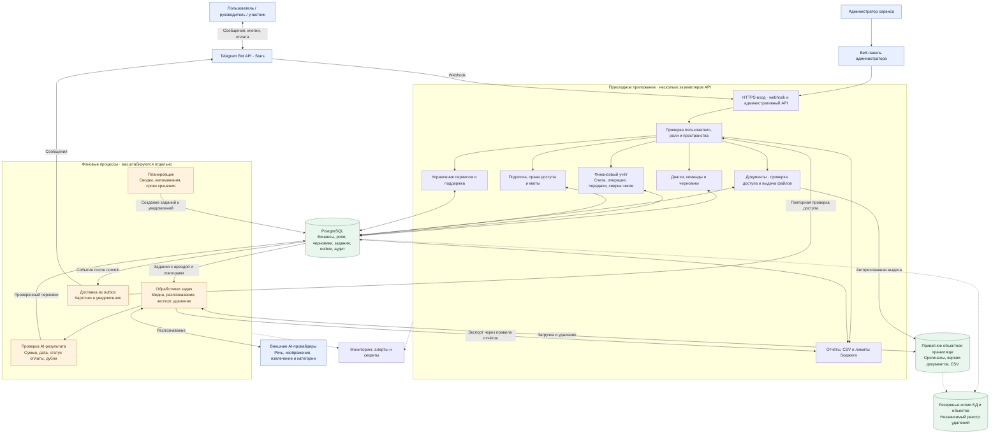
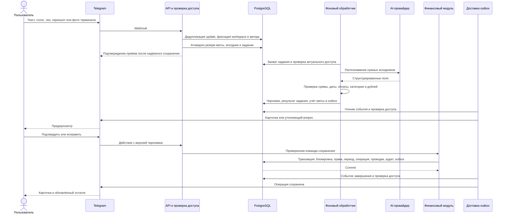
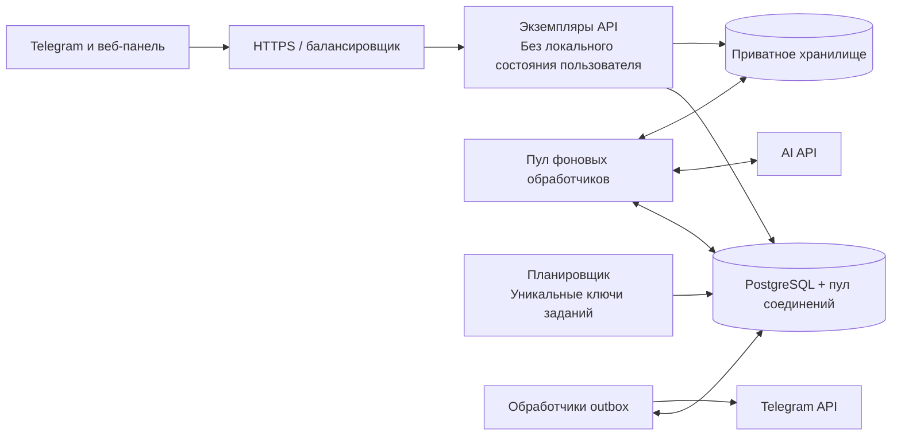

# «Баланс»: архитектура приложения

Проект · 10 сентября 2026 года. Основание: [ТЗ первой версии](01-first-version.md) и [модель данных](03-database-design.md). Это схема для реализации, а не описание уже работающей системы.

Предлагается модульный монолит: единая кодовая база с прикладным API, отдельно запускаемыми фоновыми обработчиками и планировщиком. Модули на схеме — логические границы, а не обязательные отдельные микросервисы. Язык, библиотеки и инфраструктурный провайдер пока не выбраны.

## 1. Общая схема

Стрелки обозначают обращения и потоки данных. Финансовые изменения выполняются только через финансовый модуль. AI получает необходимые исходники и возвращает структурированный результат; доступа к БД у провайдера нет.

## 2. Как сообщение становится операцией

Голос, чеки, скриншоты и фото принимаются для распознавания без отдельного запроса разрешения; обработка включена по умолчанию. Проверяется настройка ручного отключения соответствующего канала. Показан основной сценарий с подтверждением сохранения. Разрешённое настройкой автосохранение проходит те же проверки и финансовый модуль. Неоднозначные, неоплаченные и подозрительные на дубли записи требуют участия пользователя. PDF-вложения общего бюджета проходят проверку безопасности и сохранение как документы; их AI-распознавание не добавляется этой схемой в объём первой версии.

## 3. Ответственность модулей и данные

| Модуль | Ответственность | Основные таблицы из модели БД |
|---|---|---|
| Доступ | Telegram ID, личные и общие пространства, роли, временная диагностика | users, workspaces, memberships, role_grants, diagnostic_grants, admin_sessions |
| Диалог и ввод | Команды, альбомы, уточнения, версии кнопок, защита от повторов | telegram_updates, input_batches, input_messages, conversation_states, callback_actions, drafts |
| AI-обработка | Распознавание речи и изображений, категории, валидация, стоимость и повторы | processing_jobs, ai_attempts, duplicate_candidates |
| Финансовый учёт | Проверка команд, неизменяемый журнал, исправления через сторно, деньги в пути и сверка | accounts, operations, operation_revisions, journal_entries, postings, fund_transfers, transfer_events, incoming_claims |
| Документы и проверка | Приватные оригиналы, версии чеков, проверка руководителем | file_objects, operation_documents, document_versions, operation_reviews |
| Подписка | Проверенные события Stars, trial, paid, admin_free, атомарные квоты | subscriptions, payments, entitlements и таблицы квот |
| Отчёты и бюджеты | Расчёты кодом, фильтрация по роли, CSV, снимки для пересылки, пороги | budget_limits, budget_threshold_events, report_snapshots, report_parts, export_jobs |
| Доставка и расписание | Тихие часы, напоминания, повторы отправки, дедупликация | notifications, notification_preferences, outbox_events |
| Администрирование | Сервисные настройки, поддержка, аудит, удаление | support_tickets, support_messages, service_config_versions, audit_log, deletion_requests, deletion_tombstones |

## 4. Границы доступа и надёжности

- Все обращения к операциям, отчётам и вложениям проверяют роль и workspace. PostgreSQL RLS дополняет серверную проверку; фоновые процессы сохраняют контекст автора и пространства. Администратор сервиса не получает чужие финансовые данные автоматически.
- Проверка членства и проверка подписки — разные решения. Истёкшая подписка запрещает новые записи, но сохраняет разрешённые просмотр и экспорт. Общий бюджет оплачивается владельцем согласно допущению модели данных; admin_free — отдельное право.
- Остатки рассчитываются по проводкам. Передачи внутри бюджета не создают доход/расход, деньги в пути и несверенные приходы показываются отдельно. Проверка чека не отменяет факт уже учтённого расхода.
- События Stars идут через платёжный адаптер и проверки плательщика, счёта, суммы и валюты. Платёж, право доступа и outbox записываются атомарно. Скриншот оплаты не выдаёт подписку.
- На старте долговечная очередь реализуется таблицами заданий PostgreSQL. Отдельный брокер можно добавить для ускорения доставки ID задач, сохранив восстановление из БД. Redis не требуется как единственное хранилище состояния.
- Финансовая запись и outbox создаются одной транзакцией. Повтор webhook или команды не повторяет операцию; доставка сообщения Telegram при неопределённом сетевом результате может повториться.
- Обработчики используют ограниченные повторы, аренду задания и токен исполнителя. Отдельно ограничиваются AI-конкурентность, стоимость и нагрузка каждого пользователя. Постоянные ошибки доступны для разбора.
- Файлы выдаются через авторизованный прокси с актуальной проверкой прав. Резервируются БД, объекты и независимый реестр удалений; перед открытием восстановленной системы удаления применяются повторно.

## 5. Развёртывание и развитие

API и обработчики масштабируются независимо. Диалоги, задания и квоты централизованы; увеличение числа процессов не создаёт независимые копии пользовательского состояния. Начальное число экземпляров определяется нагрузочными испытаниями и бюджетом.

Цели из ТЗ: приём p95 ≤ 2 с; карточка текста ≤ 10 с, изображения ≤ 30 с, голоса до минуты ≤ 45 с; доступность собственного сервиса 99,5%; RPO ≤ 1 часа, RTO ≤ 4 часов. Это целевые требования, их достижение предстоит проверить нагрузкой и восстановлением резервных копий.

Mini App, банковские интеграции, Google Sheets, долги и накопительные цели относятся к [развитию продукта](02-product-development.md). Они подключаются через прикладные модули и те же проверки доступа. Для первой версии их развёртывать не требуется.

Карточки ввода показывают описание или позиции, сумму, категорию и дату, без бюджета, счёта, часового пояса, пояснения об источнике даты и статуса «Пока не сохранён». Голос выдаёт результат без промежуточного сообщения. Изображения распознаются автоматически; страницы Telegram-альбома собираются перед одним запросом. При нескольких позициях доступны «Разбить по категориям» и «Выбрать другую категорию». Разбиение предлагает категории товаров и показывает суммы по категориям; неполный перечень и расхождение с итогом блокируют разбиение. В отчёты входят только подтверждённые части, без общего расхода поверх них; исходные документы остаются прикреплёнными.
